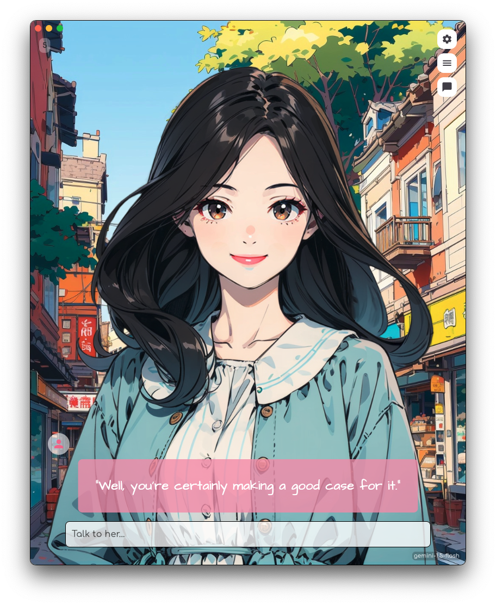
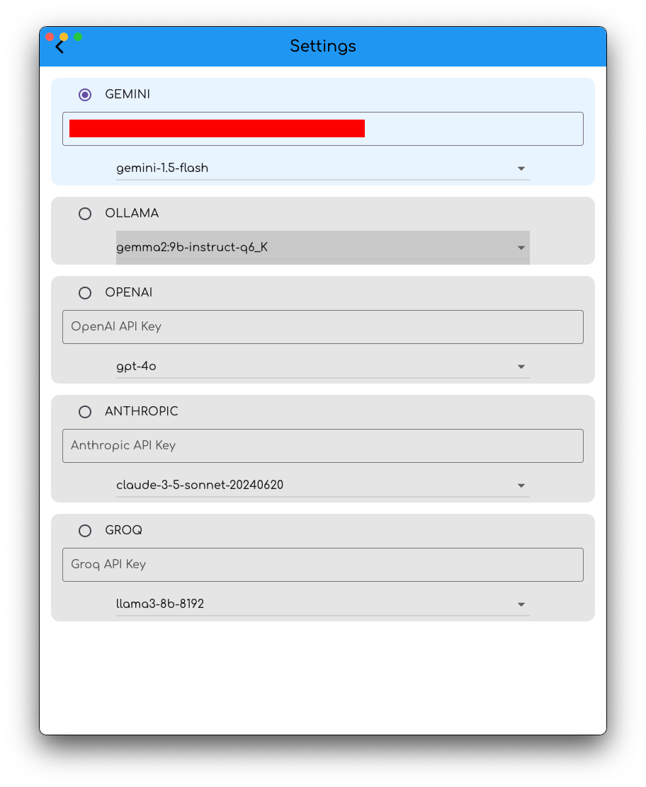

# Rizz Againt The Machine

A small game based on LLMs. [Play it for free](https://rizzatm.web.app/).
Earn or lose points based on your rizz (points are arbitrarily assigned by the LLM).

  
  

**Warning : it contains NSFW assets (nothing crazy).**

## Features

Choose from multiple LLM models (your local models via Ollama, or the most popular ones via API).

  

Quality of the game will be affected by the quality of the LLM model and its capabilities to follow the system prompts and stay in character.

Except for the clouded models, anything else is local and all information is stored in cache.

There are different expressions the avatar can display based on the interactions, and some hidden actions (like moving from a place to another).

Desktop version and Android version may be available soon.

## Demo Video on YouTube

